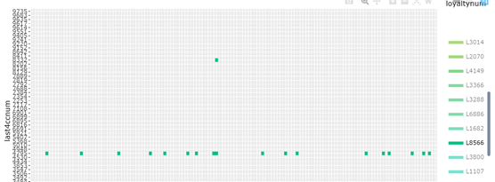

```{r setup, include=FALSE}
knitr::opts_chunk$set(echo = TRUE)
```
# 1 Overview 


## 1.1 Background of the case

Mini-Challenge 2 is to analyze movement and tracking data. GAStech provides many of their employees with company cars for their personal and professional use, but unbeknownst to the employees, the cars are equipped with GPS tracking devices. You are given tracking data for the two weeks leading up to the disappearance, as well as credit card transactions and loyalty card usage data. From this data, can you identify anomalies and suspicious behaviors? Can you identify which people use which credit and loyalty cards?


## 1.2 Literature Review / Motivation

Inspired by the 2014 VAST Challenge, I have learned many techniques from the previous submission. For example, Central South University has used the choropleth map to reveal the interaction between Employee, location as well as time elements. 


Most of the submissions also use map trajectories to detect the users of the credit card by matching traveling patterns and staying locations.

However, it is often the case that the visuals are not interactive hence the readers might be affected by the resolution of the image and size of the fonts. 

Therefore, this write-up will help to provide more interactive plots to enable the ease of interactivity in visual analytics.


# 2 Data Description and Preparation

* First of all, we need to load the necessary packages to the environment. 


```{r, echo = TRUE, results = FALSE}

packages = c( 'clock','raster', 'sf', 'tmap', 'tidyverse', 'stringi', 'plotly', 'DT', 'patchwork','readxl', 'Rcpp', 'lubridate')

for (p in packages){
  if(!require(p, character.only = T)){
    install.packages(p)
  }
  
  library(p, character.only = T)
}
```

* The datasets are loaded using read_csv.
* The locationMapping.csv was created to categorise locations 'F&B', 'Work' and 'Lifestyle'.


```{r, echo = TRUE, results = FALSE}
# read data in 
cc <- read_csv('MC2\\cc_data.csv')
loyalty <- read_csv('MC2\\loyalty_data.csv')
locationmapping <- read_csv('MC2\\LocationMapping.csv')
ap <- raster("C:\\Study\\MITB Term 3\\ISSS608 Visual Analytics\\Lesson08\\In-class_Ex08\\Geospatial\\MC2-tourist.tif")
gps <- read_csv('MC2\\gps.csv')

```

* Data Cleaning: 
* Convert the timestamp of the datasets into proper time format.
* Remove the special characters of location names


```{r, echo = TRUE}
cc$timestamp <- date_time_parse(cc$timestamp,
                                 zone = "",
                                 format = "%m/%d/%Y %H:%M")

loyalty$timestamp <- as.Date(loyalty$timestamp, 
                             format="%m/%d/%Y")

cc$date <- as.Date(cc$timestamp, 
                   format="%m/%d/%Y")
cc$location <- stri_trans_general(cc$location, 
                         
         "latin-ascii")
loyalty$location <- stri_trans_general(loyalty$location,
                                       "latin-ascii")
locationmapping$Location <- stri_trans_general(locationmapping$Location,
                                       "latin-ascii")

datatable(locationmapping)

```


Data Preprocessing 

```{r}
#join the dataset cc-data.csv and loyalty_data.csv by date, location and price
cc <- left_join(cc,locationmapping,
                by = c('location' = "Location"))
df1 <- left_join(cc, loyalty,
                 by = c('date' = 'timestamp','location', 'price'))


#adding features of the data
df1$hour <- strftime(df1$timestamp, format = "%H")
df1$datehour <- strftime(df1$timestamp, format = "%d-%H")
df1$period <- cut(as.numeric(df1$hour),
                  breaks = c(0,5,11,14,19,20,23),
                  labels = c("midnight",
                             "morning",
                             "lunch",
                             "afternoon",
                             "dinner",
                             "nignt"))

#df1$location <- stri_trans_general(df1$location, "latin-ascii")

df1$last4ccnum <- as_factor(df1$last4ccnum)
df1$loyaltynum <- as_factor(df1$loyaltynum)


```

# Question 1
Using just the credit and loyalty card data, identify the most popular locations, and when they are popular. What anomalies do you see? What corrections would you recommend correcting these anomalies? Please limit your answer to 8 images and 300 words.

* The most popular spots are mostly coffee cafes such as Brew've Been Served, Bean There Done That, Hallowed Grounds, etc. 

* Eateries have quite high visits as well. Katerina's Cafe is the highest in terms of spending records of 214 times. Hippokampos aslo have very high visits. 

```{r}
#The top few spots by visit 
df_sum <- df1 %>%
  group_by(location) %>%
  summarise(count = n())

plot1 <- ggplot(df_sum, 
                aes(x = reorder(location, count), 
                    y = count,
                    text = paste("<br>", "Count: ", count))
                )+
  geom_bar(stat = "identity",
           color = "black",
           fill = "lightblue") +
  coord_flip() 

ggplotly(plot1,
         tooltip = c('text'), height = 600, width = 800) 


```


Location visits by the time period

* For the coffee cafes, Brew've Been Saved is only visited in the morning. While Thes rest are all visited during the lunch hours.

* Katerina has high visits during lunch and dinner hours, it also has some visits during late night and afternoon hours

* More people visited Hippokampos during the morning hours.


```{r}
#location visit by the time period 
df3 <- df1 %>%
  group_by(location, period) %>%
  summarise(n = n())

plot2 <- ggplot(df3,
                aes(x = n,
                    y = location)) +
  geom_bar(stat = "identity",
           color = "black") +
  geom_col(aes(fill = period)) + 
  scale_fill_brewer(palette = "Spectral") +
  theme_light()

ggplotly(plot2, height = 600, width = 800)
```


For a more detailed breakdown, the individual graphs of each coffee cafe is ploted. It is observed that 

```{r}
#credit card by hour and location 
#library(devtools)
#("thomasp85/patchwork")
#library(patchwork)
list <- c("Kronos Mart", "Bean There Done That", "Brewed Awakenings","Jack's Magical Beans")

df2 <- df1 %>%
  group_by(location, hour) %>%
  summarise(n = n())

p1 <-
       ggplot(df2[df2$location =="Brewed Awakenings",],
       aes(x = hour, y = n)) +
       geom_bar(stat = "identity",
                  color = "black",
                  fill = "lightblue") + 
    ggtitle("Brewed Awakenings")

  p2 <-
       ggplot(df2[df2$location =="Bean There Done That",],
       aes(x = hour, y = n)) +
       geom_bar(stat = "identity",
                  color = "black",
                  fill = "lightblue") + 
    ggtitle("Bean There Done That")

  p3 <-
       ggplot(df2[df2$location =="Jack's Magical Beans",],
       aes(x = hour, y = n)) +
       geom_bar(stat = "identity",
                  color = "black",
                  fill = "lightblue") + 
    ggtitle("Jack's Magical Beans")
  
  
  p4 <-
       ggplot(df2[df2$location =="Brew've Been Served",],
       aes(x = hour, y = n)) +
       geom_bar(stat = "identity",
                  color = "black",
                  fill = "lightblue") + 
    ggtitle("Brew've Been Served")
  
  (p1 + p2)/(p3+p4)
```

transaction boxplot by location 

Some outliers are revealed by the 

```{r}
ggplotly(
  ggplot(df1[df1$Category == 'F&B',], aes(x = location,
                y = price,
                #group = Category,
                color = location,
                text = paste("Price: ", price, "<br>", "CC: ", last4ccnum, "<br>", "Timestamp: ", timestamp))) + 
    #facet_grid(rows = vars(Category)) + 
    geom_jitter(size = 0.5) +
    theme(axis.text.x = element_text(angle = 90, vjust = 0.5, hjust = 1)),
  tooltip = c('text')
)

```

```{r}
ggplotly(
  ggplot(df1[df1$Category == 'Life',], aes(x = location,
                y = price,
                #group = Category,
                color = location,
                text = paste("Price: ", price, "<br>", "CC: ", last4ccnum, "<br>", "Timestamp: ", timestamp))) + 
    #facet_grid(rows = vars(Category)) + 
    geom_jitter(size = 0.5) +
    theme(axis.text.x = element_text(angle = 90, vjust = 0.5, hjust = 1)),
  tooltip = c('text')
)
```

```{r}
ggplotly(
  ggplot(df1[df1$Category == 'Work',], aes(x = location,
                y = price,
                #group = Category,
                color = location,
                text = paste("Price: ", price, "<br>", "CC: ", last4ccnum, "<br>", "Timestamp: ", timestamp))) + 
    #facet_grid(rows = vars(Category)) + 
    geom_jitter(size = 0.5) +
    theme(axis.text.x = element_text(angle = 90, vjust = 0.5, hjust = 1)),
  tooltip = c('text')
)
```


* Katerina has high visits during lunch and dinner hours, it also has some visits during late night and afternoon hours

* More people visited Hippokampos during the morning hours.


```{r}
#location visit by the time period 
df3 <- df1 %>%
  group_by(location, period) %>%
  summarise(n = n())

plot2 <- ggplot(df3,
                aes(x = n,
                    y = location)) +
  geom_bar(stat = "identity",
           color = "black") +
  geom_col(aes(fill = period)) + 
  scale_fill_brewer(palette = "Spectral") +
  theme_light()

ggplotly(plot2, height = 600, width = 800)
```


For a more detailed breakdown, the individual graphs of each coffee cafe is ploted. It is observed that 

```{r}
#credit card by hour and location 
#library(devtools)
#("thomasp85/patchwork")
#library(patchwork)
list <- c("Kronos Mart", "Bean There Done That", "Brewed Awakenings","Jack's Magical Beans")

df2 <- df1 %>%
  group_by(location, hour) %>%
  summarise(n = n())

p1 <-
       ggplot(df2[df2$location =="Brewed Awakenings",],
       aes(x = hour, y = n)) +
       geom_bar(stat = "identity",
                  color = "black",
                  fill = "lightblue") + 
    ggtitle("Brewed Awakenings")

  p2 <-
       ggplot(df2[df2$location =="Bean There Done That",],
       aes(x = hour, y = n)) +
       geom_bar(stat = "identity",
                  color = "black",
                  fill = "lightblue") + 
    ggtitle("Bean There Done That")

  p3 <-
       ggplot(df2[df2$location =="Jack's Magical Beans",],
       aes(x = hour, y = n)) +
       geom_bar(stat = "identity",
                  color = "black",
                  fill = "lightblue") + 
    ggtitle("Jack's Magical Beans")
  
  
  p4 <-
       ggplot(df2[df2$location =="Brew've Been Served",],
       aes(x = hour, y = n)) +
       geom_bar(stat = "identity",
                  color = "black",
                  fill = "lightblue") + 
    ggtitle("Brew've Been Served")
  
  #(p1 + p2)/(p3+p4)
```

transaction boxplot  by location 

```{r}
ggplotly(
  ggplot(df1[df1$Category == 'F&B',], aes(x = location,
                y = price,
                #group = Category,
                color = location,
                text = paste("Price: ", price, "<br>", "CC: ", last4ccnum, "<br>", "Timestamp: ", timestamp))) + 
    #facet_grid(rows = vars(Category)) + 
    geom_jitter(size = 0.5) +
    theme(axis.text.x = element_text(angle = 90, vjust = 0.5, hjust = 1)),
  tooltip = c('text')
)

```

```{r}
ggplotly(
  ggplot(df1[df1$Category == 'Life',], aes(x = location,
                y = price,
                #group = Category,
                color = location,
                text = paste("Price: ", price, "<br>", "CC: ", last4ccnum, "<br>", "Timestamp: ", timestamp))) + 
    #facet_grid(rows = vars(Category)) + 
    geom_jitter(size = 0.5) +
    theme(axis.text.x = element_text(angle = 90, vjust = 0.5, hjust = 1)),
  tooltip = c('text')
)
```

```{r}
ggplotly(
  ggplot(df1[df1$Category == 'Work',], aes(x = location,
                y = price,
                #group = Category,
                color = location,
                text = paste("Price: ", price, "<br>", "CC: ", last4ccnum, "<br>", "Timestamp: ", timestamp))) + 
    #facet_grid(rows = vars(Category)) + 
    geom_jitter(size = 0.5) +
    theme(axis.text.x = element_text(angle = 90, vjust = 0.5, hjust = 1)),
  tooltip = c('text')
)
```


# Question 2

Add the vehicle data to your analysis of the credit and loyalty card data. How does your assessment of the anomalies in question 1 change based on this new data? What discrepancies between vehicle, credit, and loyalty card data do you find? Please limit your answer to 8 images and 500 words.

Mapped using the same date and same amount of price. However, some of the credit card and loyalty data could not be mapped. 

This suggests that there might be some time delay of the transactions and reflections of the details.

Furthermore, by interacting with the graph below, we can observe some loyalty card has transactions of multiple credit card.

```{r}
#consistency between the loyaltycard data and cc data
ggplotly(
  ggplot(df1 %>% filter(loyaltynum != 'NA'),
       aes(x = datehour, y = last4ccnum, fill = loyaltynum)) +
         geom_tile(stat="identity", width=1, height=.9) 
)

```

For example, there are cases that one loyalty card could be matched to multiple credit card transactions. By clicking on the loyalty card number L8566, more than one credit card number showing same date and same amount matched. 




By introducing the geo-data into the analysis. We can prove that there is some time lag of the transactions. 

For example,we can look at the Kronos Mart transactions. 

By overlaying the map and GPS data together and observe the transaction details, we can click on to the dot of the trajactories to look at the time of visit. 

it is evident that there is a 12-hour time lag of the visit and reflections of transaction details.


```{r, echo = TRUE}
tm_shape(ap) +
  tm_rgb(ap, r = 1, g = 2, b = 3,
         alpha = NA,
         saturation = 1,
         interpolate = TRUE,
         max.value = 255)

#shapefile consists of many files 
#Import vector GIS Data File 
abila_st <- st_read(dsn = 'MC2\\Geospatial',
                    layer = "Abila")

gps$Timestamp <- date_time_parse(gps$Timestamp,
                                 zone = "",
                                 format = "%m/%d/%Y %H:%M:%S")
gps$id = as_factor(gps$id)
gps$day <- as.factor(get_day(gps$Timestamp))
gps$hour <- strftime(gps$Timestamp, format = "%H")
gps$period <- cut(as.numeric(gps$hour),
                  breaks = c(0,6,12,14,19,20,23),
                  labels = c("midnight",
                             "morning",
                             "lunch",
                             "afternoon",
                             "dinner",
                             "nignt"))

gps_sf <- st_as_sf(gps,
                   coords = c("long", "lat"),
                   crs = 4326)

gps_path_selected <- gps_sf %>%
  filter(id == c('1', "5", "23")) 
tmap_mode("view")
tm_shape(ap) +
  tm_rgb(ap, r = 1, g = 2, b = 3,
         alpha = NA,
         saturation = 1,
         interpolate = TRUE,
         max.value = 255) + 
  tm_shape(gps_path_selected) +
  tm_dots(col = 'id')

kronos <- df1[c("timestamp", "location", "price")] %>%
  filter(location == "Kronos Mart")
  
mutate(kronos, timestamp = format(timestamp,"%d/%m/%Y, %H:%M:%S")) %>%
         datatable(rownames=TRUE, filter="top", class = 'cell-border stripe')


```


